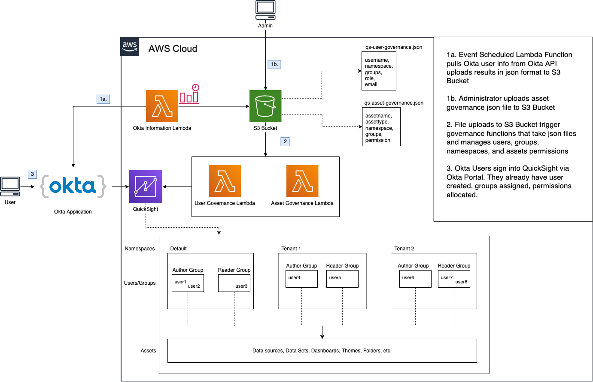

# QuickSight Governance via Okta

## Centrally manage QuickSight Namespaces, Groups, Users, and Assets while integrating with Okta

---

## Table of Contents

### 1. About

### 2. Architecture

### 3. Deployment and Set Up

### 4. Usage

### 5. Conclusion

### 6. Extended Learning

---

## 1. About

The Goal: QuickSight permissions are controlled entirely by Okta groups. User/Asset governance is centralized and automated to prevent administrators from manually creating everything in the console or command-line.

The Solution: Utilize Okta API and AWS Lambda to routinely pull group information from Okta and store relevant information in a user-manifest file.  Allow Administrators to create and manage a single asset-manifest file.  QuickSight Namespaces, Groups, Users and Asset permissions are managed entirely via these two manifest files.

---

## 2. Architecture



### Okta Group to QS User Role Mapping (Subject to Change)

| Okta Group | QuickSight Role |
|------------|--------------|
|qs_role_admin | ADMIN |
|qs_role_author | AUTHOR |
|qs_role_reader | READER |

All Other Okta Groups related to Quicksight will have prefix **qs_**

---

## 3. Guide

### a. [Okta Console] Set up Okta Application

- Sign in to your Okta admin dashboard. You can create a free Okta Developer Edition account if you don't have one.
- From the Okta admin dashboard ribbon, choose **Applications**.
- If you are viewing the Developer Console, switch to **Classic UI**.
- Choose **Add Application**.
- Search for Amazon Web Services and choose **Add**.
- Rename Application label to Amazon QuickSight and choose **Next**.
- For Sign-On Options, choose **SAML 2.0**.
- For Default Relay State, type **https://quicksight.aws.amazon.com**.
- Right-click on **Identity Provider metadata** and choose **Save Link As…**
- Save the XML file to disk and choose **Done**. You need to use this file in the next steps.

### b. [AWS Console] Set up AWS Okta IDP

Create a SAML provider in AWS

- Open a new window and sign in to the AWS Management Console.
- Open the IAM console.
- In the navigation pane, choose **Identity Providers**, **Create Provider**.
- For Provider Type, choose **SAML** and provide a Provider Name (for example, Okta).
- For Metadata Document, upload the XML file from the previous steps.
- Choose **Next Step**, **Create**.
- Locate the IdP that you just created and make note of the Provider ARN

### c. [AWS Console] Create the Secrets Manager Secret

- Sign in to the AWS Secrets Manager console at https://console.aws.amazon.com/secretsmanager/
- Choose **Store a new secret**.
- Select **Other type of secrets**
- Add Secret Key/Value pairs for each of the following Okta Information. You can find this information in your Okta account.

example:

| Secret Key | Secret Value |
|------------|--------------|
|okta-app-id-secret | abcdefghijklmnopqrst |
|okta-app-token-secret | abcdefghijklmnopqrstuv01234567890123456789 |
|okta-account-id-secret | dev-01234567 |

- click **Next**
- provide Secret Name as **okta_info**
- click **Next**, **Store**

### d. [Local] Prepare the CDK

- in the directory of this repository, navigate to **cdk_modules/config.py**
- update the config file with information related to your AWS account: (Account ID, Region, OKTA IDP, Secret)

### e. [Local] Deploy the CDK

- ensure your session is valid and you are using the correct AWS account profile.
- in the command line, run **cdk deploy**

### f. [AWS Console] Create an AWS access key for Okta

To create an access key for Okta, follow these steps.

- Open the IAM console.
- Navigate to Users -> OktaSSOUser -> Security Credentials -> Create Access Key
- To save your access key and secret key, choose Download .csv.

### g. Configure the Okta application

#### [Okta Console] Create Role Group and add Okta Users that will access QuickSight

- Create Group in okta that looks like this:

`aws_[account_id]_[FederatedRole]`

ex:  `aws_012345678901_QSGovernance-FederatedQuickSightRole`

- Add all of your quicksight users to this role.

#### [Okta Console] Update IDP Arn

- For Identity Provider ARN (Required only for SAML SSO), provide the ARN (for example, arn:aws:iam::<YOUR ACCOUNT ID>:saml-provider/Okta) of the IdP that you created in previous steps.
- Choose Done.

#### [Okta Console] Update API Integration

- From the Applications dashboard, choose Provisioning.
- Choose Configure API Integration.
- Select Enable API Integration.
- For Access Key and Secret Key, provide the access key and secret key that you downloaded in previous steps.
- Choose Test API Credentials, Save.

#### [Okta Console] Update Group Mapping

- From Applications Dashboard, choose Sign On.
- Select Edit
- Set the following values:

Group Filter: `aws_(?{{accountid}}\d+)_(?{{role}}[a-zA-Z0-9+=,.@\-_]+)`

Role Value Pattern: `arn:aws:iam::${accountid}:saml-provider/Okta,arn:aws:iam::${accountid}:role/${role}`

- Select **Use Group Mapping**

#### [Okta Console] Assign Groups to App

- Choose Assignments, Assign and then select the groups to which to grant federated access.
- Ensure to selct the Role Group. i.e. `aws_[account_id]_[FederatedRole]` that you created in the previous step.
- Choose Save and Go Back, Done.

## 4. Usage


### User Governance

After the CDK is deployed, a GetOktaInfo Lambda Function will run on a fixed schedule, getting information from Okta and configuring/placing it in S3.

#### Example User Governance - qs-user-governance.json

```json
{
   "users":[
      {
         "username":"qs4@exampletest.com",
         "email":"qs4@exampletest.com",
         "groups":[
            "Everyone",
            "qs_role_author",
            "aws_012345678901_QSGovernance-FederatedQuickSightRole"
         ]
      },
      {
         "username":"qs1@exampletest.com",
         "email":"qs1@exampletest.com",
         "groups":[
            "Everyone",
            "qs_role_admin",
            "aws_012345678901_QSGovernance-FederatedQuickSightRole"
         ]
      }
   ]
}
```

### Asset Governance

As for Asset Governance, an Administrator will need to upload a JSON file to the QSGovernance S3 Bucket. The Assets that the Administrator specifies (Datasets, Dashboards, Themes, Analyses, etc) will need to be created in QuickSight prior.

#### Example Asset Governance - qs-asset-governance.json

```json
{
   "assets":[
      {
         "name": "dataset_example_1",
         "category":"dataset",
         "namespace":"default",
         "groups": [
            "qs_group_ops",
            "qs_group_finance"
         ],
         "permission": "READ"
      },
      {
         "name": "dataset_example_2",
         "category":"dataset",
         "namespace":"default",
         "groups": [
            "qs_group_hr"
         ],
         "permission": "READ"
      }
   ]
}
```

---

## 5. Conclusion

Now, each of your Okta Users will have a QuickSight Role and Data Set Permissions automatically granted to them based on their Okta Groups. QuickSight User Governance will now be handled via Okta.  QuickSight Asset Governance will be automatically handled via Asset Manifest File Upload to S3. This prevents you from the hassle of managing quicksight users, groups, and assets individually and manually.

When Okta User launches QuickSight App from Okta portal, it will already have a QuickSight user created, user role, and permissions provided to your specified assets.

---

## 6. Extended Learning

### Cross-Account QuickSight Access

- 
- 
- 

### QuickSight Namespaces

- 
- 
- 

### QuickSight + Okta

- 
- 
- 

### Okta Attribute Mapping

- 
- 
- 

### Okta API Usage

- 
- 